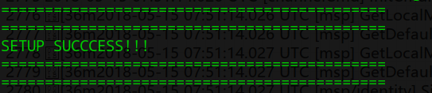
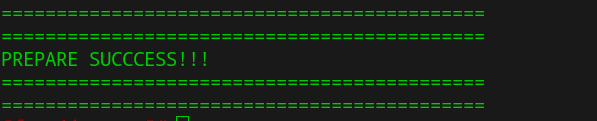

1）启动root ca

`docker-compose -f docker-compose-root-ca.yaml up -d`

2）启动中间ca

`docker-compose -f docker-compose-inter-ca.yaml up -d`

当`setup`容器出现下列日志时，表示环境证书准备完成

3）启动测试环境

`docker-compose -f docker-compose-cli.yaml up -d`

当`cli`容器出现下列日志时，表示环境准备完成，组织和channel关联完成。

可以在容器内，通过脚本

- `/scripts/simple_chaincode.sh`简单测试chaincode功能

  `add_user_test.sh`测试新增用户可调用chaincode

- `abac_test.sh`来测试验证相应的chaincode功能

  `revoke_test.sh`测试吊销用户功能生效

